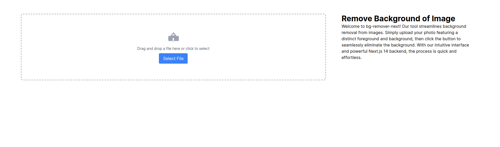
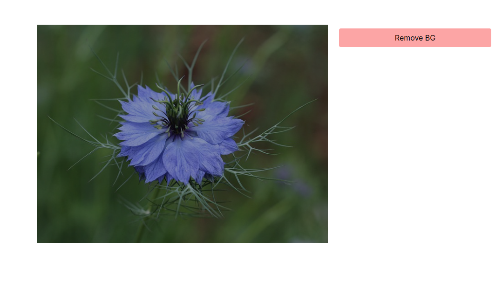
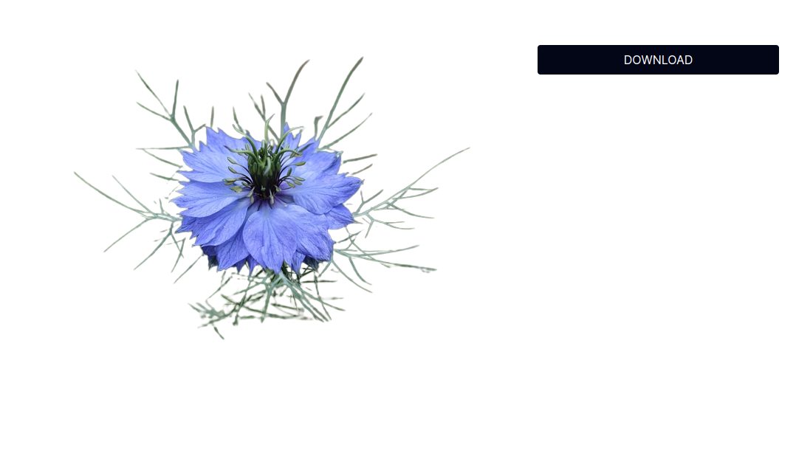
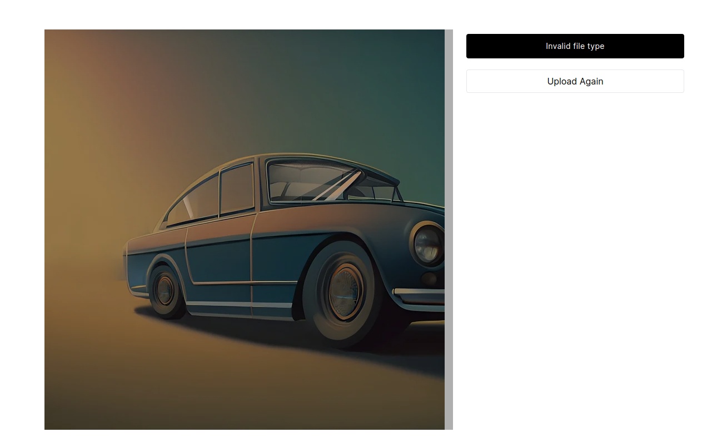

# bg-remover-next

bg-remover-next is a web application built with Next.js 14 for removing the background of images. The application uses the [Remove.bg API](https://www.remove.bg/api) to handle the background removal process.

## Features

- Upload images with a clear foreground and background
- Remove the background with a single click
- Simple and intuitive user interface

## Screenshots


*Upload an image with a clear foreground and background.*


*The image is being processed to remove the background.*


*The background is successfully removed from the image.*


*The background is not removed from the image.*

## Getting Started

These instructions will get you a copy of the project up and running on your local machine for development and testing purposes.

### Prerequisites

- Node.js (version 14 or later)
- npm (version 6 or later)

### Installation

1. Clone the repository:
    ```sh
    git clone https://github.com/yourusername/bg-remover-next.git
    cd bg-remover-next
    ```

2. Install the dependencies:
    ```sh
    npm install
    ```

3. Create a `.env` file in the root directory and add your API key:
    ```sh
    NEXT_PUBLIC_REMOVE_BG_API_KEY=your_api_key_here
    ```

4. Run the development server:
    ```sh
    npm run dev
    ```

5. Open [http://localhost:3000](http://localhost:3000) with your browser to see the result.

## Usage

1. Upload a photo with a distinct foreground and background.
2. Click the "Remove Background" button.
3. Wait for the process to complete and view the result.

## Built With

- [Next.js](https://nextjs.org/) - The React Framework
- [Remove.bg API](https://www.remove.bg/api) - Background removal API

## License

This project is licensed under the MIT License - see the [LICENSE](LICENSE) file for details.

## Acknowledgments

- [Remove.bg](https://www.remove.bg/) for providing the API

